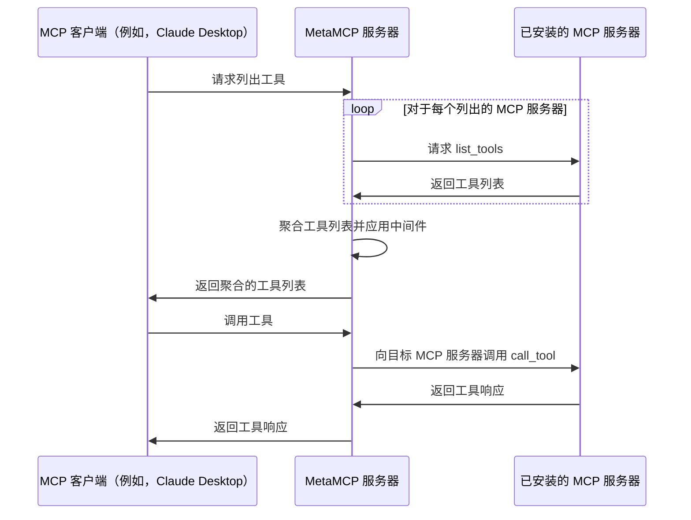
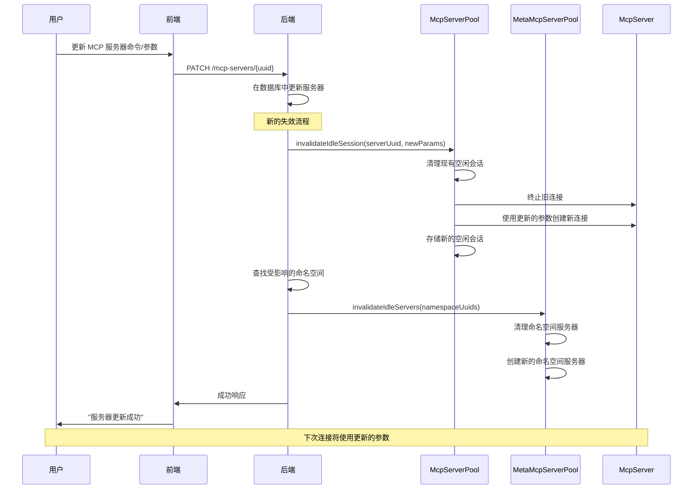

### 主要流程

```mermaid
sequenceDiagram
    participant MCPClient as MCP 客户端（例如，Claude Desktop）
    participant MetaMCP as MetaMCP 服务器
    participant MCPServers as 已安装的 MCP 服务器

    MCPClient ->> MetaMCP: 请求列出工具

    loop 对于每个列出的 MCP 服务器
        MetaMCP ->> MCPServers: 请求 list_tools
        MCPServers ->> MetaMCP: 返回工具列表
    end

    MetaMCP ->> MetaMCP: 聚合工具列表并应用中间件
    MetaMCP ->> MCPClient: 返回聚合的工具列表

    MCPClient ->> MetaMCP: 调用工具
    MetaMCP ->> MCPServers: 向目标 MCP 服务器调用 call_tool
    MCPServers ->> MetaMCP: 返回工具响应
    MetaMCP ->> MCPClient: 返回工具响应
```

### 空闲会话失效

```mermaid
sequenceDiagram
    participant User as 用户
    participant Frontend as 前端
    participant Backend as 后端
    participant McpServerPool as McpServerPool
    participant MetaMcpServerPool as MetaMcpServerPool
    participant McpServer as McpServer

    User->>Frontend: 更新 MCP 服务器命令/参数
    Frontend->>Backend: PATCH /mcp-servers/{uuid}
    Backend->>Backend: 在数据库中更新服务器
    
    Note over Backend: 新的失效流程
    Backend->>McpServerPool: invalidateIdleSession(serverUuid, newParams)
    McpServerPool->>McpServerPool: 清理现有空闲会话
    McpServerPool->>McpServer: 终止旧连接
    McpServerPool->>McpServer: 使用更新的参数创建新连接
    McpServerPool->>McpServerPool: 存储新的空闲会话
    
    Backend->>Backend: 查找受影响的命名空间
    Backend->>MetaMcpServerPool: invalidateIdleServers(namespaceUuids)
    MetaMcpServerPool->>MetaMcpServerPool: 清理命名空间服务器
    MetaMcpServerPool->>MetaMcpServerPool: 创建新的命名空间服务器
    
    Backend->>Frontend: 成功响应
    Frontend->>User: "服务器更新成功"
    
    Note over User,McpServer: 下次连接将使用更新的参数
```